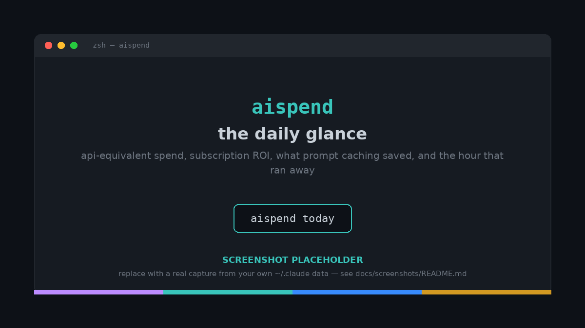
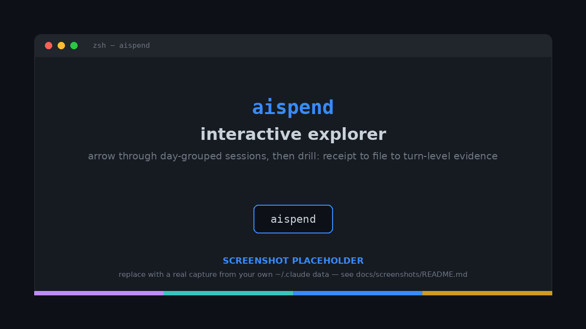
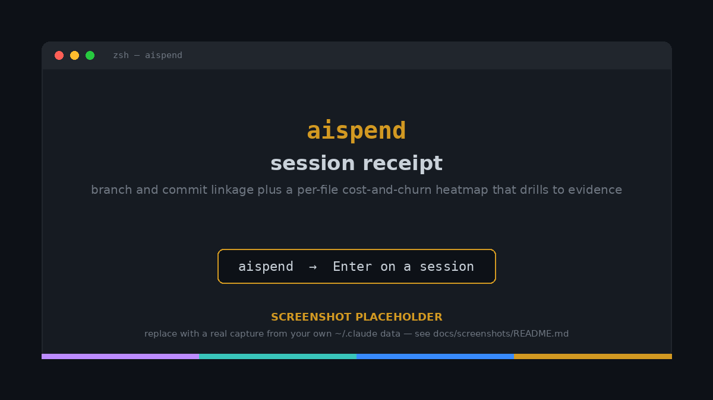

<div align="center">

# aispend

**Local, explainable spend tracking for AI coding agents.**

`aispend` reads the session logs that Claude Code and Codex already write to your
disk, prices every turn against a pinned rate table, and keeps an evidence ledger
you can open — so every number drills down to where it came from.

One static Go binary. No Node, no Python, no database to run. By default it never
touches the network, and it can _prove_ it.

[](https://github.com/cloudyali/ai-agent-spend/actions/workflows/ci.yml)
[](go.mod)
[](LICENSE)
[](#prove-its-offline)
**[aispend.cloudyali.io](https://aispend.cloudyali.io)** · powered by [CloudYali](https://cloudyali.io)

</div>



> The images here are **placeholders** — drop in real captures from your own
> machine and they'll render automatically. See [docs/screenshots](docs/screenshots/).
> Everything in fenced code blocks below is **real, unedited output** from the
> binary (run against a seeded demo dataset).

---

## Table of contents

- [Why this exists](#why-this-exists)
- [What you get](#what-you-get)
- [Quickstart](#quickstart)
- [Install](#install)
- [Prove it's offline](#prove-its-offline)
- [Commands & usage](#commands--usage)
- [How it works](#how-it-works)
- [How accurate is it?](#how-accurate-is-it)
- [Configuration](#configuration)
- [Where your data lives](#where-your-data-lives)
- [Supported agents](#supported-agents)
- [Roadmap](#roadmap)
- [Contributing](#contributing)
- [FAQ](#faq)
- [License](#license)

---

## Why this exists

Your coding agent runs on a flat monthly subscription. The meter is hidden. So a
fair question — _"what did I actually spend on AI coding this week, and on what?"_ —
has no honest answer in the tools you already use. The dashboard shows a usage bar,
not dollars. Third-party scripts spit out one number with no way to check it.

`aispend` takes the opposite stance. It treats the session transcripts your agents
_already_ write to `~/.claude` and `~/.codex` as the source of truth, prices each
turn the way the API would bill it, and then — this is the part that matters — lets
you **open any number and see the evidence underneath it**: which turn, which model,
which token classes, which file, which commit.

Think of it less like a meter and more like an itemized receipt for work you've
already done. The total is only as trustworthy as your ability to question it, so
the whole tool is built around making numbers _questionable_ — in the good sense.

And because it reads local files, it answers a second question most teams never get
to ask: **is the subscription actually a good deal?** If your `$200/mo` plan would
have cost `$11.71` in API-equivalent metering _today alone_, you have your answer.

---

## What you get

- **A daily glance worth opening.** `aispend today` leads with value, not a bare
  total: api-equivalent spend, your subscription ROI, what prompt caching saved
  you, and an hourly bar that surfaces the 2 a.m. session that looped.
- **Every number is explainable.** Drill from a day → a session → a file → a single
  turn's token-by-token cost. No "trust me," ever.
- **Subscription arbitrage, made visible.** See metered-equivalent cost next to your
  plan's daily cost, so you know whether you're under- or over-using your seat.
- **Cache-aware pricing.** Claude Code workloads are dominated by prompt-cache reads
  and writes; `aispend` prices the 5-minute and 1-hour cache tiers correctly, which
  is where naive trackers drift.
- **Spend tied to shipped code.** Group by `branch`, `commit`, or `file`, and
  optionally write per-commit cost back into your git history as trailers.
- **Provably offline.** The default build contains no network-capable code path.
  `aispend doctor --network` asserts it; an `offline` build compiles `net/*` out
  entirely.
- **One binary, zero runtime.** Pure Go, vendored, no codegen. Drop it on your PATH
  and go.

---

## Quickstart

```sh
# 1. install (macOS/Linux) — see Install for Homebrew, go install, prebuilt, etc.
curl -fsSL https://raw.githubusercontent.com/cloudyali/ai-agent-spend/main/install.sh | sh

# 2. look at today — read commands scan new sessions for you on launch (no network)
aispend today
```

That's it — there's nothing to run first. On launch, a read command (`today`,
`report`, `top`, the TUI) brings the ledger current with a watermark-gated incremental
scan of `~/.claude/projects` and `~/.codex/sessions`, prices each new turn, and stores
the result under `~/.aispend` — all offline. Want the explicit step, or to read the
ledger exactly as-is? `aispend scan` still imports on demand, and `--no-scan` (or
`scan_on_launch = false`) skips the auto-scan. Here's what that first scan reports:

```text
claude_code · 2 source(s) · imported 17 · 2026-06-22 → 2026-06-22
codex · 1 source(s) · imported 6 · 2026-06-22 → 2026-06-22
Imported 23 events total · stored in /Users/you/.aispend/events.json · no network calls made
```

And the daily glance:

```text
aispend today · Mon Jun 22

  $11.71 api-equivalent  ·  plan $7.33/day · 1.6× ROI
  cache saved ~$55.88 (83%)  ▓▓▓▓▓▓▓▓··
  23 turns · 2 sessions · opus-4-8 75%
  by hour   █▁   ▂▁  peak 01:00 · $7.29
  Claude weekly unknown — no local usage snapshot
  budget $300.00/mo  ··········  $11.71 used (4%) · 71% of month · under
```

Set a plan (`aispend plans`) to unlock the ROI line, and you're done.

---

## Install

Pick whichever fits. Every path lands you the same binary, and every path lets you
verify what you ran.

### Homebrew (macOS)

```sh
brew install cloudyali/tap/aispend
```

### Install script (macOS / Linux)

Downloads the right prebuilt binary from GitHub Releases and verifies its SHA-256
against the published `checksums.txt` **before** installing:

```sh
curl -fsSL https://raw.githubusercontent.com/cloudyali/ai-agent-spend/main/install.sh | sh
```

Not a fan of pipe-to-shell? Read the script first, or skip it and do it
[by hand](#from-a-prebuilt-binary) — every step is one you can run yourself. Knobs:

```sh
# pin a version, or choose where it lands
AISPEND_VERSION=v0.2.0 AISPEND_BIN_DIR="$HOME/.local/bin" \
  sh -c "$(curl -fsSL https://raw.githubusercontent.com/cloudyali/ai-agent-spend/main/install.sh)"
```

### With Go

```sh
go install github.com/cloudyali/ai-agent-spend/cmd/aispend@latest
```

### From a prebuilt binary

Every release ships binaries for macOS and Linux (amd64 + arm64) and Windows, plus a
`checksums.txt`. Grab them from the
[Releases page](https://github.com/cloudyali/ai-agent-spend/releases), verify, and
drop on your PATH:

```sh
# example: macOS arm64
tar -xzf aispend_0.2.0_darwin_arm64.tar.gz
shasum -a 256 -c checksums.txt --ignore-missing   # or: sha256sum -c
sudo mv aispend /usr/local/bin/
```

### From source

Pure Go, vendored, no codegen — `git clone` and build:

```sh
git clone https://github.com/cloudyali/ai-agent-spend
cd ai-agent-spend
go build ./cmd/aispend
```

### The offline build

Want the binary that _physically can't_ reach the network? Build the offline SKU —
a build tag compiles out every `net/*` import (and the interactive TUI, which links
a terminal-UI dependency that pulls `net/*`). The same artifact ships on each
release as `aispend-offline_*`:

```sh
go build -tags offline ./cmd/aispend
```

It's also noticeably smaller, because all the network and TUI code is simply gone:

```text
10 MB   aispend            (default build)
4.5 MB  aispend-offline    (net/* + TUI compiled out)
```

---

## Prove it's offline

Trust shouldn't be a tagline. `doctor` inspects the binary's own import graph and
tells you exactly what it can and can't do:

```text
$ aispend doctor --network
default build: no network-capable sink in import graph  ✓
inbound only: `aispend pricing refresh` may GET https://aispendllm.cloudyali.io/litellm.json (no data sent)
RESULT: PASS — this binary cannot phone home
```

The only outbound call the default build can _ever_ make is a single inbound GET to
refresh public price data — and it only happens when you explicitly run
`aispend pricing refresh`. Nothing about your sessions, code, or spend leaves your
machine. The offline build can't even do that:

```text
$ aispend doctor --network          # offline build
default build: no network-capable sink in import graph  ✓
offline build: price refresh disabled (no net/* compiled in)
RESULT: PASS — this binary cannot phone home
```

This isn't a promise in a privacy policy — it's asserted in CI and checkable on
your own copy.

---

## Commands & usage

```text
$ aispend help
aispend 0.1.0-dev — local, explainable AI-coding spend

Usage: aispend <command>   (no command opens the interactive TUI; off a TTY it shows `today`)

  scan [--verbose]              import & price new sessions (no network); --verbose shows skips
  report [--period P] [flags]   spend over a calendar window (default: this week)
  today                         arbitrage-first daily glance: ROI, cache savings, hourly spikes
  top [--period P] [--sessions] priciest turns (or sessions) in a window
  tui [--period P]              interactive explorer: arrow sessions, ↵ to drill to the receipt → file → turn evidence (not in offline build)
  doctor [--network] [--paths]  prove the trust promise / show data locations
  plans                         list known subscription plans (seeded prices)
  pricing [refresh]             show the active rate source; 'refresh' pulls live LiteLLM rates
  git <install|status|…>        install per-commit cost-trailer hooks (safe; honors hook managers)
  version                       print version

  today/report/top/tui scan new sessions on launch first; --no-scan reads the ledger as-is
```

A bare `aispend` (no command) opens the interactive explorer when it can — it needs
a real terminal. Off a TTY, in a pipe, or in the offline build, it falls back to the
static `today` glance, which carries the same numbers and never bleeds color codes
into your pipe.

### `scan` — import & price

Reads every new session your agents have written since the last scan (it keeps a
watermark, so re-running is cheap), prices each turn, and stores the result. No
network, ever.

```text
$ aispend scan
claude_code · 2 source(s) · imported 17 · 2026-06-22 → 2026-06-22
codex · 1 source(s) · imported 6 · 2026-06-22 → 2026-06-22
Imported 23 events total · stored in /Users/you/.aispend/events.json · no network calls made
```

Use `--full` after upgrading to re-read everything, and `--verbose` to see a sample
of any records it skipped.

### `today` — the daily glance

The view most people open first. It leads with value: api-equivalent spend, the
subscription ROI clause, what caching saved, a turns/sessions/top-model strip, and
an hourly spike bar that catches the run that got away.

```text
$ aispend today
aispend today · Mon Jun 22

  $11.71 api-equivalent  ·  plan $7.33/day · 1.6× ROI
  cache saved ~$55.88 (83%)  ▓▓▓▓▓▓▓▓··
  23 turns · 2 sessions · opus-4-8 75%
  by hour   █▁   ▂▁  peak 01:00 · $7.29
  Claude weekly unknown — no local usage snapshot
  budget $300.00/mo  ··········  $11.71 used (4%) · 71% of month · under
```

Read that `1.6× ROI` as: today's work would have cost 1.6× your blended daily plan
fee if you'd paid the metered API rate. The `cache saved` line is the other half of
the wedge — prompt caching took an `~$67` day down to `$11.71`.

### `report` — spend over any calendar window

`report` is the workhorse. It defaults to the current week grouped by model, and it
only ever speaks in **calendar** windows (today, this week, last month, a quarter, a
date range) — never a rolling window, so two people comparing "last month" mean the
same thing.

```text
$ aispend report
AI-coding spend · this week · by model · view: api-equivalent (token_priced, confidence 0.95)
  claude-opus-4-8         $8.74  ▓▓▓▓▓▓▓···  75%
  gpt-5-codex             $1.71  ▓·········  15%
  claude-sonnet-4-6       $1.26  ▓·········  11%
  total                  $11.71  (23 events)
```

**Pick your window** with `--period`:

```text
today | yesterday | week | month | "last week" | "last month" |
quarter | "last quarter" | "this year" | "last year" | "N days" (e.g. "90 days") |
"since YYYY-MM-DD" | YYYY-MM-DD..YYYY-MM-DD | all
```

**Slice it** with `--by` — `model`, `repo`, `provider`, `cost_tag`, `session`,
`branch`, `commit`, or `file`:

```text
$ aispend report --period today --by provider
AI-coding spend · today · by provider · view: api-equivalent (token_priced, confidence 0.95)
  claude_code            $10.00  ▓▓▓▓▓▓▓▓▓·  85%
  codex                   $1.71  ▓·········  15%
  total                  $11.71  (23 events)
```

```text
$ aispend report --period today --by file
AI-coding spend · today · by file · view: api-equivalent (token_priced, confidence 0.95)
  internal/ledger/alloc.go            $2.65  ▓▓········  23%
  (no files)                          $2.58  ▓▓········  22%
  internal/billing/webhook.go         $1.66  ▓·········  14%
  internal/recon/job.go               $1.04  ▓·········   9%
  internal/billing/webhook_test.go    $0.83  ▓·········   7%
  internal/ledger/money.go            $0.73  ▓·········   6%
  migrations/0042_recon_idx.sql       $0.65  ▓·········   6%
  src/components/Checkout.jsx         $0.42  ··········   4%
  …
  total                              $11.71  (23 events)
```

(`--by file` fans a turn's cost out evenly across the files it touched, so the rows
still sum to the total; turns that edited no file bucket as `(no files)`.)

**Choose a cost view** with `--view`. There is no single "true cost" — `aispend`
models several, each with its own provenance and confidence:

| View | What it answers |
|---|---|
| `api_equivalent` _(default)_ | What metered API billing would have charged for these tokens. |
| `reported` | The cost the agent itself recorded, when it wrote one (`costUSD`). |
| `effective_allocated` | Your subscription fee amortized across the work it covered. |
| `estimated` / `billed` / `marginal` | Other lenses, surfaced where computable. |

A view that can't be computed says so — it returns "not computable here," never a
misleading `$0`.

**Get JSON** for any token-priced view with `--json` — including the per-token-class
breakdown that powers the evidence drill:

```json
{
  "period": "today",
  "group_by": "provider",
  "view": "api_equivalent",
  "method": "token_priced",
  "confidence": 0.95,
  "groups": [
    {
      "key": "claude_code",
      "cost_usd": 10.0025,
      "count": 17,
      "percent": 85.39,
      "cost_components": {
        "input":          { "usd": 0.56  },
        "output":         { "usd": 0.982 },
        "cache_read":     { "usd": 6.128 },
        "cache_write":    { "usd": 2.1525 },
        "cache_write_1h": { "usd": 0.18  }
      }
    }
  ]
}
```

### `top` — the priciest turns (or sessions)

Where did the money actually go? `top` ranks individual turns; `--sessions` ranks
whole sessions.

```text
$ aispend top --period today
aispend top · today · priciest turns

   1      $1.47  evt_fa8eafa4dc35929b  opus-4-8  s sess_pay…  14,800 in / 5,200 out / 1,880,000 cache-read
   2      $1.17  evt_95612769ea957b50  opus-4-8  s sess_pay…  12,200 in / 4,100 out / 1,510,000 cache-read
   3      $1.04  evt_bebbad2cac0e311f  opus-4-8  s sess_pay…  10,400 in / 3,600 out / 1,320,000 cache-read
   …
  → open `aispend` (the explorer) and drill in for the full evidence · `--sessions` to rank sessions
```

```text
$ aispend top --period today --sessions
aispend top · today · priciest sessions

   1      $8.74  sess_pay…  11 turns · opus-4-8
   2      $1.26  sess_web…  6 turns · sonnet-4-6
```

### `aispend` / `tui` — the interactive explorer

A bare `aispend` opens the explorer (this is the default channel). It's a
day-grouped session list with a live badge for sessions still in flight; `↵` drills
one level deeper each time: **session → receipt → file → turn-level evidence**. One
`↑`/`↓` cursor flows from the file heatmap straight into the top turns, and `tab`
jumps between them.



The **session receipt** is where spend meets shipped code: a `branch · SHA` line and
a per-file **cost + churn heatmap** (a cost-shaded bar plus `+adds/-dels` per file),
where every row is a real file you can drill into for its evidence.



The interactive explorer needs a real terminal, and it's not in the offline build:

```text
$ aispend tui        # piped / no TTY
aispend tui needs an interactive terminal; try `aispend top` or `aispend report`

$ aispend tui        # offline build
aispend: `tui` is unavailable in the offline build (it would link a terminal-UI
dependency that pulls net/*). Use `aispend top`, `aispend today`, or `aispend report`.
```

> The rich **static** surfaces (`today`, `report`, the receipt) are hand-rolled,
> zero-dependency ANSI — no Bubble Tea, no lipgloss — so they survive in the offline
> build and degrade cleanly to plain ASCII off a TTY, under `NO_COLOR`, or with
> `TERM=dumb`. Only the interactive explorer links a TUI framework.

### `git` — per-commit cost trailers (opt-in)

Want spend recorded _in_ your git history? `aispend git install` adds a safe commit
hook (it honors existing hook managers) that stamps each commit with the
api-equivalent cost of the work on that branch.

```text
$ aispend git install
✓ aispend trailer hooks installed (/path/to/repo/.git/hooks)
  trailers attach on your next commit; tune them in .aispend.toml [trailers]
  `aispend git status` to check · `aispend git uninstall` to remove
```

`aispend today` previews what your next commit would carry:

```text
  pending commit main: $11.56 · 19 turns (uncommitted)
```

…and the commit itself comes out stamped:

```text
$ git log -1
commit fe30c34452677c03f9d73b2a602c165d101f6336
Author: Nishant <dev@example.com>

    feat: add healthcheck endpoint

    AI-Cost: 11.56
    AI-Cost-Models: claude-opus-4-8=9.85,gpt-5-codex=1.71
    AI-Tokens: input=246700,output=54100,cache_read=13595000,cache_write=351000,cache_write_1h=18000
```

Every field is configurable (or off) in the repo's `.aispend.toml [trailers]` block.

### `plans` & `pricing`

`aispend plans` lists the seeded subscription plans (set one to unlock ROI):

```text
$ aispend plans
Known subscription plans (run `aispend plans` in a terminal to pick interactively, or set `plan = "<id>"` in ~/.aispend/config.toml):
    chatgpt-go           $  8.00/mo   ChatGPT Go (incl. Codex)
    chatgpt-plus         $ 20.00/mo   ChatGPT Plus (incl. Codex)
    chatgpt-pro          $200.00/mo   ChatGPT Pro (incl. Codex)
    claude-max-20x       $200.00/mo   Claude Max 20x
    claude-max-5x        $100.00/mo   Claude Max 5x
    claude-pro           $ 20.00/mo   Claude Pro
    claude-team          $ 25.00/mo   Claude Team (per seat)
    claude-team-premium  $125.00/mo   Claude Team Premium (per seat)
```

`aispend pricing` shows the active rate source; `aispend pricing refresh` is the one
command that touches the network (a single inbound GET of a public price file):

```text
$ aispend pricing
rate source: embedded table pricing-2026-06
  run `aispend pricing refresh` to overlay live LiteLLM rates (one inbound fetch, no data sent)
```

---

## How it works

```text
  ~/.claude/projects/**.jsonl ─┐
                               ├─► scan ─► normalize ─► attribute ─► enrich VCS ─► price ─► ledger (~/.aispend)
  ~/.codex/sessions/**.jsonl ──┘                                                              │
                                                                                              ▼
                                                          today · report · top · tui · git trailers
```

A few principles do the heavy lifting:

**Local by default, truthfully.** The default build contains _no cloud code_. The
cloud sink lives behind a build tag; a security audit of the default binary finds
nothing that can phone home, and CI asserts it. `doctor --network` lets you check
your own copy.

**Evidence over assertion.** Every number carries where it came from — which parser,
which pricing table, and how confident the method is (`token_priced`,
`subscription_amortized`, …). The TUI's drill renders that ledger; `report --json`
exposes it. This is the moat, not a detail.

**No single "true cost."** Billed, api-equivalent, effective-allocated, marginal,
reported — each is a different honest answer to a different question. `aispend`
models them separately, and a view that can't be computed returns nil, never `$0`.

**Cache-aware pricing — the subtle part.** On high-cache-hit workloads, cost is
_dominated_ by the cache, so the cache rates matter most:

| Provider | Cache write | Cache read | Notes |
|---|---|---|---|
| **Anthropic** | 1.25× input (5-min tier) · **2× input (1-hour tier)** | 0.10× input | The 1-hour tier is derived in code and applied only to the 1-hour token subset. |
| **OpenAI / Codex** | none (no cache-write charge) | ~0.5× input | The cached-input discount, _not_ the 10% Anthropic heuristic; automatic TTL. |

Getting the 1-hour Anthropic tier right is exactly where simpler trackers drift.

**Offline-first pricing.** `scan`/`report` price against a fresh (≤24 h) LiteLLM
cache at `~/.aispend/pricing/litellm.json` when you've refreshed one, otherwise the
embedded table. Live rates _overlay_ the embedded table, which stays the floor for
any model LiteLLM doesn't list. Only `pricing refresh` fetches.

**Spend tied to shipped code (VCS linkage).** Each event carries the git branch it
ran on (Claude Code logs it per turn) and the commit that was HEAD at the turn's
timestamp — reconstructed best-effort from the repo's reflog, **pure-Go, no git
binary, no network**. Per-file churn is captured once per session. That's what makes
`--by branch`, `--by commit`, `--by file`, and the receipt heatmap possible.

**Money is never a float.** Costs are integer micro-units (`1 USD = 1,000,000
micros`) with an explicit currency, so rounding can't silently corrupt a total.

---

## How accurate is it?

`aispend` is reconciled against the two best-known community tools, **ccusage** and
**CodeBurn**, which split the same Anthropic cache TTL tiers. On the same sessions, the token-level pricing
matches; the small residual that remains traces to **event counting** (how streaming
placeholder turns are de-duplicated), not to the pricing math.

Two implementation details drive that:

- **Keep-max dedup.** Claude Code emits streaming placeholder turns with tiny token
  counts that later resolve to the real totals. `aispend` dedupes on
  `(message.id, requestId)` and keeps the maximum, so a streamed turn is counted
  once at its true size — no double-count, no placeholder undercount.
- **Reported cost is preserved.** When the agent wrote its own `costUSD`, the
  `reported` view surfaces it verbatim, so you can compare the agent's own number to
  the token-priced one side by side.

The honest summary: the numbers reconcile to within a few percent of the reference
tools, and where they differ, `aispend` will _show you the turn_ so you can decide
who's right. That's the whole point.

> **Pre-release note:** rates are public list prices captured for June 2026 and are
> meant to be verified against the live price lists before you rely on them for
> anything billable. `aispend pricing refresh` overlays current LiteLLM rates.

---

## Configuration

Two optional files, both plain TOML. `aispend` works with neither.

### `~/.aispend/config.toml` — your plan & budget

```toml
plan           = "claude-max-20x"  # unlocks the ROI line; see `aispend plans`
codex_plan     = "chatgpt-plus"    # per-provider override: <provider>_plan
budget_usd     = 300               # optional monthly ceiling → pace line in `today`
scan_on_launch = true              # default; read commands auto-scan new sessions (false to require `aispend scan`)
```

### `.aispend.toml` — per-repo attribution & trailers

Dropped at a repo root; `aispend` walks up to find the nearest one. Use it to tag a
repo's spend and to tune commit trailers:

```toml
project  = "payments"
cost_tag = "team-billing"   # show up under `report --by cost_tag`
env      = "prod"

[trailers]
enabled     = true
cost        = true
cost_models = true
tokens      = true
precision   = 3
```

---

## Where your data lives

`doctor --paths` prints exactly where everything is read from and written to:

```text
$ aispend doctor --paths
os: linux
app home: /Users/you/.aispend
events:   /Users/you/.aispend/events.json
claude_code roots:
  /Users/you/.claude/projects               ✓ exists
```

Nothing is written outside `~/.aispend`. Source paths in the ledger are **hashed**,
not stored in the clear, so the ledger can't be reverse-engineered back to your repo
layout. Honoring `CLAUDE_CONFIG_DIR` and the standard macOS/Linux/Windows locations
is handled by a single platform layer.

---

## Supported agents

| Agent | Status | Source |
|---|---|---|
| **Claude Code** | ✅ Supported | `~/.claude/projects/**/*.jsonl` (incl. Claude Desktop / Cowork sessions) |
| **OpenAI Codex** | ✅ Supported | `~/.codex/sessions/**/rollout-*.jsonl` |
| Cursor | 🔜 Planned | — |
| Gemini | 🔜 Planned | billed by cache _storage time_ — needs its own model |

`scan` auto-detects whichever agents have local data; you don't configure providers.

---

## Roadmap

`aispend` is **Phase 0A** — early, but working end-to-end on real `~/.claude` and
`~/.codex` data. The through-line across every phase is _explainability_: any number,
at any tier, opens to its evidence. The commercial layer (cloud reconciliation in
CloudYali) is strictly **additive** — no local feature is ever removed or gated
behind an account.

| Phase | Goal |
|---|---|
| **0A** _(now)_ | A trusted, explainable local ledger for Claude Code + Codex. |
| **0B** | More agents (Cursor) without silent estimates; fact-based cost-driver findings. |
| **1A** | Durable ingestion (OTel / admin APIs) that matches file parsing on someone else's machine. |
| **1B** | Self-hosted team roll-up with k-anonymity — aggregate without a per-person scoreboard. |
| **2** | Reconcile coding-agent spend with API / invoice / seat spend in one pane. |
| **3** | Emit a fix (a LiteLLM rule, a Claude Code hook) from a detected cost driver. |

---

## Contributing

Contributions are welcome. The project has a few **non-negotiable** conventions —
they're what keep the numbers trustworthy:

- **t-wada-style TDD.** Write the failing test first (confirm it's RED), the minimal
  code to GREEN, then refactor. Every change lands with tests.
- **85–90% coverage minimum**, per package.
- **Reviews before done.** Run a code review and a security review on your changes.

### Build & test

Pure Go, vendored, no network needed:

```sh
go build ./cmd/aispend
go test ./...                  # keep it green
go test ./internal/... -cover  # 85–90% min per package
gofmt -l internal/ && go vet ./...
```

Have a look at [`CLAUDE.md`](CLAUDE.md) and the `design-documents/` folder (start at
[`00-index.md`](design-documents/00-index.md)) — the design record is unusually
complete and is the fastest way to understand _why_ a thing is the way it is.

---

## FAQ

**Does it send my code or prompts anywhere?**
No. The default build has no network-capable code path at all (`doctor --network`
proves it), and the offline build compiles `net/*` out entirely. The only outbound
call that exists is an opt-in GET of public price data via `pricing refresh`.

**Do I need an API key or to log in?**
No. `aispend` reads the session logs your agents already write locally. There's
nothing to authenticate.

**Why is it a single binary with no database?**
Because the bar for "I trust this with my spend data" is lower when there's nothing
to run, nothing to connect to, and one file to read. The ledger is a JSON file under
`~/.aispend`.

**It says my cost is "not computable" for a turn — is that a bug?**
No — it's the honesty rule. When a view genuinely can't be computed (e.g. no plan set
for `effective_allocated`), `aispend` says so rather than printing a misleading `$0`.

**How is this different from `ccusage` / CodeBurn?**
Same lineage, different emphasis: `aispend` is built around _drilling into the
evidence_ for any number, models multiple cost views (not one), prices the Anthropic
1-hour cache tier explicitly, ties spend to branches/commits/files, and is provably
offline by construction. See [How accurate is it?](#how-accurate-is-it).

---

## License

[MIT](LICENSE) © 2026 CloudYali and the aispend contributors.
