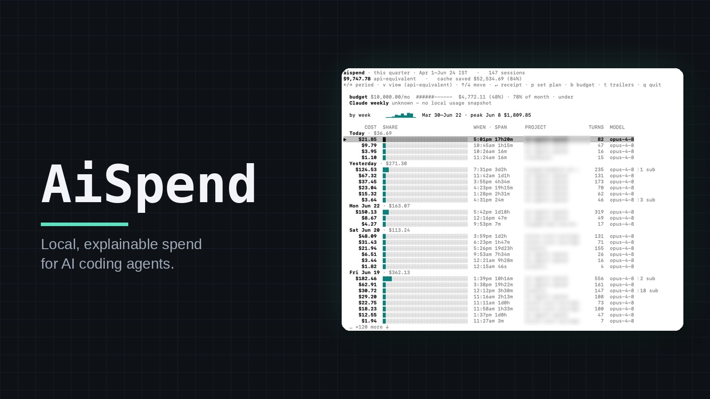
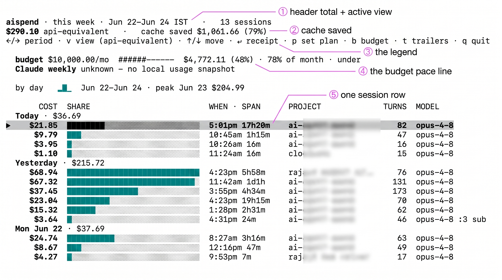
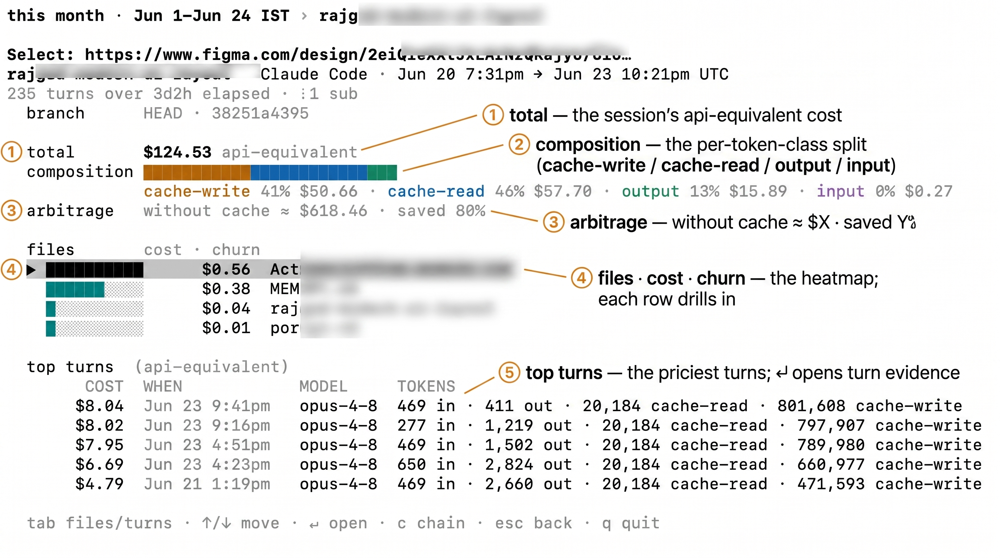
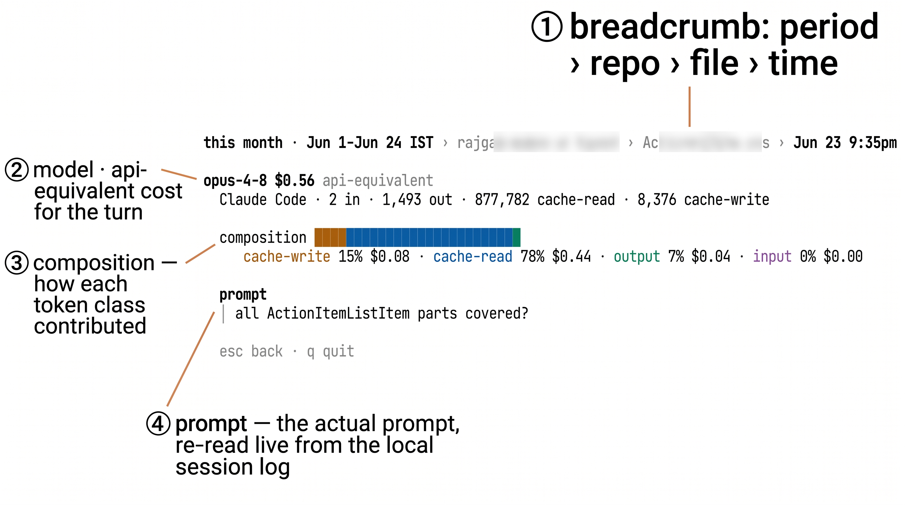
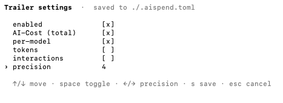
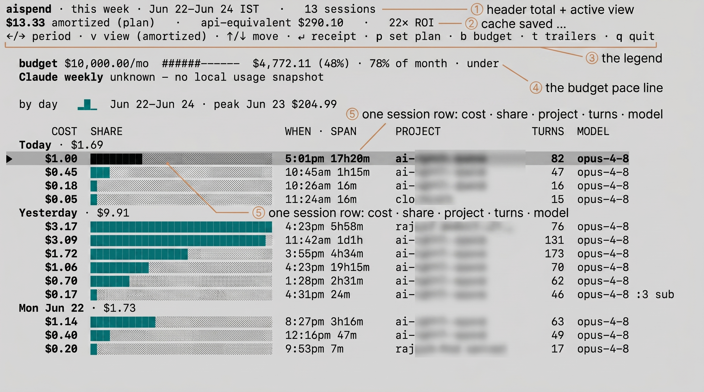
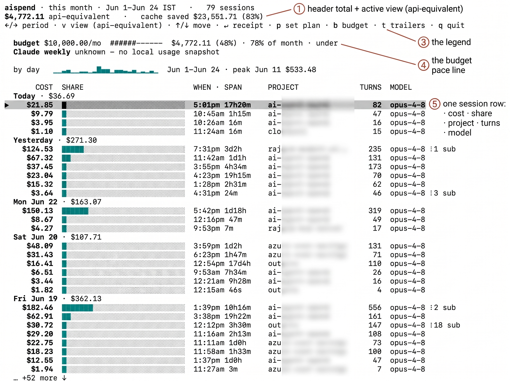
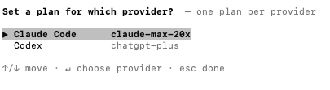
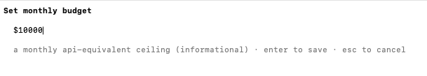

<div align="center">



# AiSpend

AI coding agents bill a flat monthly fee and don't expose the per-token meter. `aispend` parses the session logs Claude Code and Codex already write to disk, prices every turn at published API rates, and stores an evidence ledger you can drill into. You get the API-equivalent cost of your work, and every number traces back to its source: turn, model, token class, file, commit.

Single static Go binary — no Node, no Python, no daemon, no database. It reads local files only; the one network call is an optional refresh of public price data, which `doctor --network` discloses.

[](https://github.com/cloudyali/ai-agent-spend/actions/workflows/ci.yml) [](go.mod) [](LICENSE) [](#prove-its-offline) **[aispend.cloudyali.io](https://aispend.cloudyali.io)** · powered by [CloudYali](https://cloudyali.io)

</div>

> Screenshots live in [`docs/screenshots`](docs/screenshots/) — that folder's README has the capture commands and the filename map. Everything in fenced code blocks below is **real, unedited output** from the binary.

---

## Table of contents

- [AiSpend](#aispend)
  - [Table of contents](#table-of-contents)
  - [Why this exists](#why-this-exists)
  - [What you get](#what-you-get)
  - [Use cases](#use-cases)
  - [Quickstart](#quickstart)
  - [Install](#install)
    - [Homebrew (macOS)](#homebrew-macos)
    - [Install script (macOS / Linux)](#install-script-macos--linux)
    - [With Go](#with-go)
    - [From a prebuilt binary](#from-a-prebuilt-binary)
    - [From source](#from-source)
    - [The offline build](#the-offline-build)
  - [Supported OS](#supported-os)
  - [Prove it's offline](#prove-its-offline)
  - [Commands \& usage](#commands--usage)
    - [`scan` — import \& price](#scan--import--price)
    - [`daemon` — keep the ledger current in the background](#daemon--keep-the-ledger-current-in-the-background)
    - [`today` — the daily glance](#today--the-daily-glance)
    - [`report` — spend over any calendar window](#report--spend-over-any-calendar-window)
    - [`top` — the priciest turns (or sessions)](#top--the-priciest-turns-or-sessions)
    - [`aispend` / `tui` — the interactive explorer](#aispend--tui--the-interactive-explorer)
    - [`git` — per-commit cost trailers (opt-in)](#git--per-commit-cost-trailers-opt-in)
    - [`plans` \& `pricing`](#plans--pricing)
  - [Views \& periods](#views--periods)
  - [How it works](#how-it-works)
  - [How accurate is it?](#how-accurate-is-it)
  - [Configuration](#configuration)
    - [`~/.aispend/config.toml` — your plan \& budget](#aispendconfigtoml--your-plan--budget)
    - [`.aispend.toml` — per-repo attribution \& trailers](#aispendtoml--per-repo-attribution--trailers)
  - [Where your data lives](#where-your-data-lives)
  - [Supported agents](#supported-agents)
  - [Contributing](#contributing)
    - [Build \& test](#build--test)
  - [FAQ](#faq)
  - [License](#license)

---

## Why this exists

Coding agents — Claude Code, Codex, Cursor, OpenCode, and others — mostly bill a flat monthly subscription and don't expose a per-token meter. The cost underneath is still tokens: input, output (priced higher), and cache reads/writes, with prompt caching absorbing much of the bill on cache-heavy workloads. Price your real usage at the providers' published API rates and the API-equivalent number is often nowhere near the subscription price. Flat pricing is an acquisition strategy; metered pricing is the likely endgame, and most setups can't measure the gap.

`aispend` measures it. It reads the session transcripts your agents already write to `~/.claude` and `~/.codex`, prices each turn the way the API would (per token class, caches included), and lets you open any number to see what it's made of: which turn, model, file, and commit. Group spend by `branch`, `commit`, or `file` for cost per check-in; the hourly view surfaces an overnight session that looped.

Because everything is derived from local files, it also tells you whether the subscription pays off: API-equivalent spend next to your plan's daily cost. A `$200/mo` plan that would have metered at `$11.71` today is a clear ROI signal.

No API keys, no credentials, and none of your session data leaves the machine. The only outbound request is a refresh of public model prices to keep rates current; it sends no user data, `doctor --network` discloses it, and the `offline` build removes it.

---

## What you get

- **Daily glance.** `aispend today` shows api-equivalent spend, subscription ROI, prompt-cache savings, and an hourly bar that flags a runaway 2 a.m. session.
- **Every number is explainable.** Drill from a day → session → file → a single turn's token-by-token cost. Nothing is asserted without evidence.
- **Subscription arbitrage.** Metered-equivalent cost sits next to your plan's daily cost, so you can tell whether you're under- or over-using the seat.
- **Cache-aware pricing.** Coding agent workloads are dominated by prompt-cache reads and writes; `aispend` prices the 5-minute and 1-hour cache tiers separately.
- **Spend tied to shipped code.** Group by `branch`, `commit`, or `file`, and optionally write per-commit cost back to git history as trailers.
- **Provably offline.** The default build has no code path that can send your data anywhere; `aispend doctor --network` asserts it. Its one network call is an inbound pull of public model prices, and the `offline` build compiles `net/*` out entirely.
- **One binary, no runtime.** Pure Go, vendored, no codegen. Put it on your PATH and run.

---

## Use cases

Common reasons to reach for it:

- **"Am I getting my money's worth?"** You're on a `$20`–`$200/mo` plan and the meter is hidden. `aispend today` puts api-equivalent spend next to your plan's daily cost, so the ROI line settles it — are you under-using the seat, or squeezing 3× the value out of it?
- **"What on earth happened at 2 a.m.?"** An agent got into a loop overnight and you can feel it but can't see it. The hourly spike bar in `today` points at the hour; `aispend top` names the exact turns and the session that ran away.
- **"Which feature did the spend go to?"** Group by `branch`, `commit`, or `file` to tie cost to shipped work — for a client invoice, a cost-per-feature readout, or just answering your own _"was that refactor worth it?"_ Commit trailers can bake the number straight into your git history.
- **"Opus or Codex for this kind of task?"** `report --by model` / `--by provider` shows what each agent actually costs you on real work, so you reach for the right one instead of the expensive one out of habit.
- **"I can't send my code to a SaaS dashboard."** Under an NDA, in a regulated shop, or just privacy-minded? `aispend` reads only local files and has no code path that can send your data anywhere — `doctor --network` proves it (its one network call just pulls public model prices, and the `offline` build removes even that).
- **"Did caching actually save me anything?"** Cache-aware pricing shows what prompt caching shaved off the day, so you can tell whether your prompt structure is pulling its weight.

---

## Quickstart

```sh
# install (macOS/Linux) — see Install for Homebrew, go install, prebuilt, etc.
curl -fsSL https://raw.githubusercontent.com/cloudyali/ai-agent-spend/main/install.sh | sh

# run it — a bare `aispend` opens the interactive TUI; `aispend today` is the static glance
aispend today
```

Nothing to set up first. On launch a read command (`today`, `report`, `top`, the TUI) brings the ledger current with a watermark-gated incremental scan of `~/.claude/projects` and `~/.codex/sessions`, prices each new turn, and stores the result under `~/.aispend` — all local. (`aispend scan` imports on demand; `--no-scan` reads the ledger as-is.)

```text
aispend today · Mon Jun 22

  $11.71 api-equivalent  ·  plan $7.33/day · 1.6× ROI
  cache saved ~$55.88 (83%)  ▓▓▓▓▓▓▓▓··
  23 turns · 2 sessions · opus-4-8 75%
  by hour   █▁   ▂▁  peak 01:00 · $7.29
  Claude weekly unknown — no local usage snapshot
  budget $300.00/mo  ··········  $11.71 used (4%) · 71% of month · under
```

A minute of setup makes the numbers sharper:

**1 · Set your subscription plan** — unlocks the ROI line and the amortized view.

- _CLI:_ `aispend plans` opens an interactive picker (provider → plan → start date) in a terminal, or prints the catalog otherwise. Prefer config? Put `plan = "claude-max-20x"` (and a per-provider `codex_plan = "chatgpt-plus"`) in `~/.aispend/config.toml`.
- _TUI:_ press **`p`** in the explorer, pick a plan, and it jumps to the amortized view.

**2 · Set a monthly budget** — adds the pace line in `today`. It's informational; `aispend` never blocks a run or a commit.

- _CLI:_ add `budget_usd = 300` to `~/.aispend/config.toml`.
- _TUI:_ press **`b`**, type the dollar amount, `↵` to save.

**3 · Stamp cost into git (optional)** — `cd` into a repo and run `aispend git install`; each commit then carries its api-equivalent cost as an `AI-Cost:` trailer. Full setup in [git trailers](#git--per-commit-cost-trailers-opt-in).

**4 · Switch the cost lens** — metered cost vs. your subscription.

- _CLI:_ `aispend report --view api_equivalent` (default) or `--view amortized`.
- _TUI:_ press **`v`** to cycle views (amortized appears once a plan is set).

Details on every view and time window are in [Views & periods](#views--periods).

---

## Install

Pick whichever fits. Every path lands you the same binary, and every path lets you verify what you ran.

### Homebrew (macOS)

```sh
brew install cloudyali/tap/aispend
```

### Install script (macOS / Linux)

Downloads the right prebuilt binary from GitHub Releases and verifies its SHA-256 against the published `checksums.txt` **before** installing:

```sh
curl -fsSL https://raw.githubusercontent.com/cloudyali/ai-agent-spend/main/install.sh | sh
```

Not a fan of pipe-to-shell? Read the script first, or skip it and do it [by hand](#from-a-prebuilt-binary) — every step is one you can run yourself. Knobs:

```sh
# pin a version, or choose where it lands
AISPEND_VERSION=v0.2.0 AISPEND_BIN_DIR="$HOME/.local/bin" \
  sh -c "$(curl -fsSL https://raw.githubusercontent.com/cloudyali/ai-agent-spend/main/install.sh)"
```

### With Go

```sh
go install github.com/cloudyali/ai-agent-spend/cmd/aispend@latest
```

### From a prebuilt binary

Every release ships binaries for macOS, Linux, and Windows (amd64 + arm64) — see [Supported OS](#supported-os) for the per-platform status — plus a `checksums.txt`. Grab them from the [Releases page](https://github.com/cloudyali/ai-agent-spend/releases), verify, and drop on your PATH:

```sh
# example: macOS arm64
tar -xzf aispend_0.2.0_darwin_arm64.tar.gz
shasum -a 256 -c checksums.txt --ignore-missing   # or: sha256sum -c
sudo mv aispend /usr/local/bin/
```

### From source

Pure Go, vendored, no codegen — `git clone` and build:

```sh
git clone https://github.com/cloudyali/ai-agent-spend
cd ai-agent-spend
go build ./cmd/aispend
```

### The offline build

Want the binary that _physically can't_ reach the network? Build the offline SKU — a build tag compiles out every `net/*` import (and the interactive TUI, which links a terminal-UI dependency that pulls `net/*`). The same artifact ships on each release as `aispend-offline_*`:

```sh
go build -tags offline ./cmd/aispend
```

It's also noticeably smaller, because all the network and TUI code is simply gone:

```text
10 MB   aispend            (default build)
4.5 MB  aispend-offline    (net/* + TUI compiled out)
```

---

## Supported OS

`aispend` is one static, dependency-free Go binary, so it runs anywhere Go cross- compiles. Every release ships both the standard and the [offline](#the-offline-build) SKU for all three desktop OSes, in `amd64` and `arm64`. What differs is how thoroughly each is exercised — and `aispend` would rather tell you that than imply a uniform guarantee it can't back up.

| OS | Status | Arch | Install | Data lives in |
|---|---|---|---|---|
| **Linux** | ✅ Supported · runs in CI on every push | amd64 · arm64 | [install script](#install) or `go install` | `~/.aispend` |
| **macOS** | ✅ Supported · primary dev platform | Apple Silicon (arm64) · Intel (amd64) | [Homebrew](#install) or install script | `~/.aispend` |
| **Windows** | 🧪 Experimental · build-verified, not yet CI-tested | amd64 · arm64 | prebuilt `.zip` or `go install` | `%USERPROFILE%\.aispend` |

**Linux** is where CI runs the full suite (including non-UTC timezones) on every push, so it's the most exercised target. **macOS** is the primary development platform — it's what the screenshots above come from — and is fully supported; it just isn't in the automated matrix yet. A binary you download through a browser may get Gatekeeper-quarantined ("app is damaged"); the Homebrew cask clears that for you, or run `xattr -dr com.apple.quarantine ./aispend` once by hand.

**Windows** is honestly experimental. The binaries build and ship, the path layer already resolves Windows locations (`%USERPROFILE%`, `%APPDATA%`), and the per-OS logic is unit-tested — but it isn't covered by CI yet and isn't a daily-driven platform, so treat the numbers as community-tested until that lands. The shell installer and Homebrew don't target Windows; grab the `.zip` from the [Releases page](https://github.com/cloudyali/ai-agent-spend/releases) or use `go install`. Bug reports from Windows users are especially welcome.

> Broadening CI to macOS and Windows runners is tracked on the [pre-release checklist](RELEASE_CHECKLIST.md).

---

## Prove it's offline

Trust shouldn't be a tagline. `doctor` inspects the binary's own import graph and tells you exactly what it can and can't do:

```text
$ aispend doctor --network
default build: no network-capable sink in import graph  ✓
inbound only: `aispend pricing refresh` may GET https://aispendllm.cloudyali.io/litellm.json (no data sent)
RESULT: PASS — this binary cannot phone home
```

The only network call the default build can _ever_ make is an inbound GET that refreshes public price data. It runs automatically when the cached rates are missing or older than 24h, and on demand via `aispend pricing refresh` — you can switch the automatic top-up off with `--no-refresh`, `AISPEND_NO_REFRESH=1`, or `refresh_on_launch = false`. Either way the call only pulls prices in; nothing about your sessions, code, or spend ever leaves your machine. The offline build can't even do that:

```text
$ aispend doctor --network          # offline build
default build: no network-capable sink in import graph  ✓
offline build: price refresh disabled (no net/* compiled in)
RESULT: PASS — this binary cannot phone home
```

This isn't a promise in a privacy policy — it's asserted in CI and checkable on your own copy.

---

## Commands & usage

`aispend` has two modes:

- **TUI — the default.** Run `aispend` with no command and it opens the interactive Terminal UI: a day-grouped session list you arrow through, then `↵` to drill from a session into its receipt → a file → a single turn's evidence, each `↵` one level deeper. The TUI is the default channel — new surfaces land here first, and `--watch` live-refreshes it in place.
- **CLI — one-shot and scriptable.** Every command also prints a static answer and exits: `aispend today`, `report`, `top`, `scan`, `doctor`, and the rest. These degrade to plain ASCII off a TTY, under `NO_COLOR`, or with `TERM=dumb`, and never bleed an escape code into a pipe — safe for scripts, cron, and CI.

A bare `aispend` opens the TUI only when it can: with no real terminal, piped output, or the `offline` build (where the TUI is compiled out), it falls back to the static `today` glance, which carries the same numbers.

```text
$ aispend help
aispend 0.1.0-dev — local, explainable AI-coding spend

Usage: aispend <command>   (no command opens the interactive TUI; off a TTY it shows `today`)

  scan [--verbose]              import & price new sessions (no network); --verbose shows skips
  report [--period P] [flags]   spend over a calendar window (default: this week)
  today                         arbitrage-first daily glance: ROI, cache savings, hourly spikes
  top [--period P] [--sessions] priciest turns (or sessions) in a window
  tui [--period P]              interactive explorer: arrow sessions, ↵ to drill to the receipt → file → turn evidence (not in offline build)
  doctor [--network] [--paths]  prove the trust promise / show data locations
  plans                         list known subscription plans (seeded prices)
  pricing [refresh]             show the active rate source; 'refresh' pulls live LiteLLM rates
  git <install|status|…>        install per-commit cost-trailer hooks (safe; honors hook managers)
  version                       print version

  today/report/top/tui scan new sessions on launch first; --no-scan reads the ledger as-is
```

### `scan` — import & price

Reads every new session your agents have written since the last scan (it keeps a watermark, so re-running is cheap), prices each turn, and stores the result. No network, ever.

```text
$ aispend scan
claude_code · 2 source(s) · imported 17 · 2026-06-22 → 2026-06-22
codex · 1 source(s) · imported 6 · 2026-06-22 → 2026-06-22
Imported 23 events total · stored in /Users/you/.aispend/events.json · no network calls made
```

Use `--full` after upgrading to re-read everything (it ignores the watermark, then resets the checkpoint to the latest), and `--verbose` to see a sample of any records it skipped.

### `daemon` — keep the ledger current in the background

If you'd rather not rely on a read command to trigger the scan, `aispend daemon` runs the same incremental import on a timer. It scans once immediately (catch-up), then every interval — default **15 minutes** — picking up only sessions newer than the last checkpoint. It's the same per-provider watermark `scan` and the read commands use, so nothing is scanned twice.

```text
$ aispend daemon
aispend daemon: scanning every 15m0s · incremental from the last checkpoint · press Ctrl-C to stop
[09:15:02] scanned 6 new turns
[09:30:01] scanned 2 new turns
^C
aispend daemon: stopped
```

Set the cadence with `--interval 5m` (or `scan_interval = 5m` in `~/.aispend/config.toml`). Use `--once` to run a single cycle and exit — the clean entrypoint when you'd rather have **cron**, **launchd**, or a **systemd timer** own the schedule. The daemon is offline-safe: local reads only, and unlike a read-command launch it never refreshes prices. It stops cleanly on Ctrl-C / SIGTERM, and all of its output goes to stderr.

### `today` — the daily glance

The view most people open first. It leads with value: api-equivalent spend, the subscription ROI clause, what caching saved, a turns/sessions/top-model strip, and an hourly spike bar that catches the run that got away.

```text
$ aispend today
aispend today · Mon Jun 22

  $11.71 api-equivalent  ·  plan $7.33/day · 1.6× ROI
  cache saved ~$55.88 (83%)  ▓▓▓▓▓▓▓▓··
  23 turns · 2 sessions · opus-4-8 75%
  by hour   █▁   ▂▁  peak 01:00 · $7.29
  Claude weekly unknown — no local usage snapshot
  budget $300.00/mo  ··········  $11.71 used (4%) · 71% of month · under
```

Read that `1.6× ROI` as: today's work would have cost 1.6× your blended daily plan fee if you'd paid the metered API rate. The `cache saved` line is the other half of the wedge — prompt caching took an `~$67` day down to `$11.71`.

### `report` — spend over any calendar window

`report` is the workhorse. It defaults to the current week grouped by model, and it only ever speaks in **calendar** windows (today, this week, last month, a quarter, a date range) — never a rolling window, so two people comparing "last month" mean the same thing.

```text
$ aispend report
AI-coding spend · this week · by model · view: api-equivalent (token_priced, confidence 0.95)
  claude-opus-4-8         $8.74  ▓▓▓▓▓▓▓···  75%
  gpt-5-codex             $1.71  ▓·········  15%
  claude-sonnet-4-6       $1.26  ▓·········  11%
  total                  $11.71  (23 events)
```

**Pick your window** with `--period`:

```text
today | yesterday | week | month | "last week" | "last month" |
quarter | "last quarter" | "this year" | "last year" | "N days" (e.g. "90 days") |
"since YYYY-MM-DD" | YYYY-MM-DD..YYYY-MM-DD | all
```

**Slice it** with `--by` — `model`, `repo`, `provider`, `cost_tag`, `session`, `branch`, `commit`, or `file`:

```text
$ aispend report --period today --by provider
AI-coding spend · today · by provider · view: api-equivalent (token_priced, confidence 0.95)
  claude_code            $10.00  ▓▓▓▓▓▓▓▓▓·  85%
  codex                   $1.71  ▓·········  15%
  total                  $11.71  (23 events)
```

```text
$ aispend report --period today --by file
AI-coding spend · today · by file · view: api-equivalent (token_priced, confidence 0.95)
  internal/ledger/alloc.go            $2.65  ▓▓········  23%
  (no files)                          $2.58  ▓▓········  22%
  internal/billing/webhook.go         $1.66  ▓·········  14%
  internal/recon/job.go               $1.04  ▓·········   9%
  internal/billing/webhook_test.go    $0.83  ▓·········   7%
  internal/ledger/money.go            $0.73  ▓·········   6%
  migrations/0042_recon_idx.sql       $0.65  ▓·········   6%
  src/components/Checkout.jsx         $0.42  ··········   4%
  …
  total                              $11.71  (23 events)
```

(`--by file` fans a turn's cost out evenly across the files it touched, so the rows still sum to the total; turns that edited no file bucket as `(no files)`.)

**Choose a cost view** with `--view`. There is no single "true cost" — `aispend` models several, each with its own provenance and confidence:

| View | What it answers |
|---|---|
| `api_equivalent` _(default)_ | What metered API billing would have charged for these tokens. |
| `reported` | The cost the agent itself recorded, when it wrote one (`costUSD`). |
| `amortized` | Your subscription fee amortized across the work it covered. |
| `estimated` / `billed` / `marginal` | Other lenses, surfaced where computable. |

A view that can't be computed says so — it returns "not computable here," never a misleading `$0`.

**Get JSON** for any token-priced view with `--json` — including the per-token-class breakdown that powers the evidence drill:

```json
{
  "period": "today",
  "group_by": "provider",
  "view": "api_equivalent",
  "method": "token_priced",
  "confidence": 0.95,
  "groups": [
    {
      "key": "claude_code",
      "cost_usd": 10.0025,
      "count": 17,
      "percent": 85.39,
      "cost_components": {
        "input":          { "usd": 0.56  },
        "output":         { "usd": 0.982 },
        "cache_read":     { "usd": 6.128 },
        "cache_write":    { "usd": 2.1525 },
        "cache_write_1h": { "usd": 0.18  }
      }
    }
  ]
}
```

### `top` — the priciest turns (or sessions)

Where did the money actually go? `top` ranks individual turns; `--sessions` ranks whole sessions.

```text
$ aispend top --period today
aispend top · today · priciest turns

   1      $1.47  evt_fa8eafa4dc35929b  opus-4-8  s sess_pay…  14,800 in / 5,200 out / 1,880,000 cache-read
   2      $1.17  evt_95612769ea957b50  opus-4-8  s sess_pay…  12,200 in / 4,100 out / 1,510,000 cache-read
   3      $1.04  evt_bebbad2cac0e311f  opus-4-8  s sess_pay…  10,400 in / 3,600 out / 1,320,000 cache-read
   …
  → open `aispend` (the explorer) and drill in for the full evidence · `--sessions` to rank sessions
```

```text
$ aispend top --period today --sessions
aispend top · today · priciest sessions

   1      $8.74  sess_pay…  11 turns · opus-4-8
   2      $1.26  sess_web…  6 turns · sonnet-4-6
```

### `aispend` / `tui` — the interactive explorer

A bare `aispend` opens the explorer (the default channel): a day-grouped session list with a live badge for sessions still in flight. You drill **down** with `↵` and back **up** with `esc`, one level at a time — **session list → receipt → file → turn evidence**. A bar along the bottom always lists the keys for where you are; from the session list that's `←/→` period · `v` view · `↑/↓` move · `↵` receipt · `p` set plan · `b` budget · `t` trailers · `c` commits · `q` quit (`p`/`b`/`t`/`c` show when they apply).



**The session receipt** is where spend meets shipped code: a `branch · SHA` line (with the trailer reconciliation badge, if you've installed them) and a per-file **cost + churn heatmap** — a cost-shaded bar plus `+adds/-dels` per file. One `↑`/`↓` cursor flows from the file heatmap straight into the session's top turns; `tab` jumps between the two sections.



**The files view** is one file's slice of the session — every turn that touched it, priced. `↵` on a file row opens it; `↵` on a turn (in the receipt or the files view) opens that turn's evidence.

**A turn is one request/interaction** — a single round-trip to the model, the atomic unit `aispend` prices (one `AgentEvent` internally); a session is a run of turns. **Turn evidence** is the deepest drill, and it answers "why is this number what it is":

- the model, provider, and api-equivalent cost for the turn;
- token counts (input / output / cache-read / cache-write);
- the **cost composition** — the receipt's color language — showing how each token class contributed, in percent and dollars;
- the **actual prompt** behind the turn, when it's still resolvable.

That last point is the honest bit: `aispend` doesn't store your prompts — the ledger keeps only a prompt id. On drill-in it re-reads the original session log on your disk to show the prompt (`↑`/`↓` to scroll); if that log is gone it just prints `prompt (unavailable — session log not found)`. Nothing is copied into the ledger, and nothing leaves your machine.



The interactive explorer needs a real terminal, and it's not in the offline build:

```text
$ aispend tui        # piped / no TTY
aispend tui needs an interactive terminal; try `aispend top` or `aispend report`

$ aispend tui        # offline build
aispend: `tui` is unavailable in the offline build (it would link a terminal-UI
dependency that pulls net/*). Use `aispend top`, `aispend today`, or `aispend report`.
```

> The rich **static** surfaces (`today`, `report`, the receipt) are hand-rolled, zero-dependency ANSI — no Bubble Tea, no lipgloss — so they survive in the offline build and degrade cleanly to plain ASCII off a TTY, under `NO_COLOR`, or with `TERM=dumb`. Only the interactive explorer links a TUI framework.

### `git` — per-commit cost trailers (opt-in)

`aispend` attributes spend to commits on the read side (`report --by commit`, the receipt's `branch · SHA` line). This is the write side: an opt-in git hook stamps the api-equivalent cost of a commit's work _into_ the commit message as a trailer (`AI-Cost: 0.42`). The number then travels with the code — visible in `git log`, a PR diff, or GitHub blame, with nothing installed on the other end — and still drills back to the full receipt in `aispend` via the commit SHA.

**Setup is per-repo.** The hooks live in that clone's `.git/hooks` (or its hook manager) and are never committed, so run `install` from inside the repo, once per clone (or pass the path: `aispend git install <dir>`):

```text
$ cd /path/to/your/repo
$ aispend git install
✓ aispend trailer hooks installed (/path/to/your/repo/.git/hooks)
  trailers attach on your next commit; tune them in .aispend.toml [trailers]
  `aispend git status` to check · `aispend git uninstall` to remove
```

That's the whole setup. With no config the default is a single `AI-Cost` line, and your next commit is stamped automatically — the hook runs a quick incremental scan first, so you don't have to `aispend scan` by hand:

```text
$ git log -1
commit fe30c34452677c03f9d73b2a602c165d101f6336
Author: Nishant <dev@example.com>

    feat: add healthcheck endpoint

    AI-Cost: 11.56
    AI-Cost-Models: claude-opus-4-8=9.85,gpt-5-codex=1.71
    AI-Tokens: input=246700,output=54100,cache_read=13595000,cache_write=351000,cache_write_1h=18000
```

A commit with no attributable AI usage gets **no** trailer (never a misleading `AI-Cost: 0.00`). Check the hook state with `aispend git status`; `aispend git uninstall` removes only aispend's hooks:

```text
$ aispend git uninstall
✓ removed 2 aispend hook(s) from /path/to/your/repo/.git/hooks
```

**Which lines attach** is set in the repo's `.aispend.toml` — committed and reviewed, so a whole team emits identical trailers:

```toml
[trailers]
enabled      = true   # repo-wide gate; false suppresses trailers even with hooks installed
cost         = true   # AI-Cost:          total api-equivalent (the default line)
cost_models  = false  # AI-Cost-Models:   per-model breakdown
tokens       = false  # AI-Tokens:        input/output/cache_read/cache_write/cache_write_1h
interactions = false  # AI-Interactions:  deduped request count
precision    = 2      # decimals on cost (clamped 0–8)

[trailers.rename]
cost = "AI-Cost"      # rename the cost key if you prefer
```

> The trailer is the **api-equivalent** cost — what the work would have metered at the API — not cash billed against your subscription.

**Hook managers.** If the repo uses Husky, Lefthook, or pre-commit (or sets `core.hooksPath`), `install` won't clobber them: it prints the paste-ready line to add to the manager's `prepare-commit-msg` / `post-commit`, and `aispend git status` (and `doctor`) report `trailer wiring: detected | NOT detected`, so a managed repo never silently looks installed while stamping nothing.

**In the TUI.** Trailers surface back in the interactive explorer:

- `aispend today` and the TUI preview the pending stamp before you commit — `pending commit main: $11.56 · 19 turns (uncommitted)`.
- The **session receipt** adds a reconciliation badge under `branch · SHA`, e.g. `✓ trailer $0.42 in git · ledger $0.41 · Δ +$0.01`, comparing the cost frozen in the commit against the live ledger (no badge if the commit isn't in the current repo).
- Press **`c`** for the commit view: per-commit ledger spend (SHA · cost · turns · branch · time), git-independent, gaining the commit title and an in-git-trailer badge when the repo is present; `↵` opens the message and a ledger-vs-trailer reconciliation.
- Press **`t`** for the trailers editor: toggle the `[trailers]` lines above and write them straight to `.aispend.toml` — no hand-editing TOML.



### `plans` & `pricing`

`aispend plans` lists the seeded subscription plans (set one to unlock ROI):

```text
$ aispend plans
Known subscription plans (run `aispend plans` in a terminal to pick interactively, or set `plan = "<id>"` in ~/.aispend/config.toml):
    chatgpt-go           $  8.00/mo   ChatGPT Go (incl. Codex)
    chatgpt-plus         $ 20.00/mo   ChatGPT Plus (incl. Codex)
    chatgpt-pro          $200.00/mo   ChatGPT Pro (incl. Codex)
    claude-max-20x       $200.00/mo   Claude Max 20x
    claude-max-5x        $100.00/mo   Claude Max 5x
    claude-pro           $ 20.00/mo   Claude Pro
    claude-team          $ 25.00/mo   Claude Team (per seat)
    claude-team-premium  $125.00/mo   Claude Team Premium (per seat)
```

`aispend pricing` shows the active rate source; `aispend pricing refresh` is the one command that touches the network (a single inbound GET of a public price file):

```text
$ aispend pricing
rate source: embedded table pricing-2026-06
  run `aispend pricing refresh` to overlay live LiteLLM rates (one inbound fetch, no data sent)
```

---

## Views & periods

Every surface answers the same question through two dials: **which cost view** (how the work is priced) and **which period** (the window of time).

### Cost views

There's no single "true" cost, so `aispend` models several and always labels the one you're looking at. The two that matter most:

- **api-equivalent** _(default)_ — what metered API billing would have charged for these tokens at public rates. The reproducible "what it would've cost on the API" number.
- **amortized** — your flat subscription fee, prorated over the period and allocated across the work it covered (needs a plan set). The "what you actually pay, spread over what you did" number. Side by side, the two are the arbitrage: seat price vs. metered value.

`reported` (the agent's own `costUSD`), `estimated`, `billed`, and `marginal` are there too where computable; a view that can't be computed says so rather than showing a misleading `$0`.

| Surface | api-equivalent | amortized | other views |
|---|---|---|---|
| **CLI** (`report --view`) | `api_equivalent` _(default)_ | `amortized` | `reported`, `estimated`, `billed`, `marginal` |
| **TUI** | the default lens | press **`v`** (after a plan is set) | **`v`** cycles every view present |

The same week, two lenses — metered cost, then the subscription prorated over it (the ROI line flips on in amortized):




### Periods

Windows are always **calendar-aligned**, never rolling — so "last month" means the same thing to everyone.

- **CLI** — `report --period` (also `top --period`): `today` · `yesterday` · `week` · `month` · `"last week"` · `"last month"` · `quarter` · `"last quarter"` · `"this year"` · `"last year"` · `"N days"` (e.g. `"90 days"`) · `"since YYYY-MM-DD"` · `YYYY-MM-DD..YYYY-MM-DD` · `all`. Default is `week`. (`today` is fixed to the current day and takes no period.)
- **TUI** — press **`←`/`→`** to widen or narrow the window through `today → week → this month → last month → quarter → last quarter → this year → last year → all`. The header shows the active window and its date span.



---

## How it works

```text
  ~/.claude/projects/**.jsonl ─┐
                               ├─► scan ─► normalize ─► attribute ─► enrich VCS ─► price ─► ledger (~/.aispend)
  ~/.codex/sessions/**.jsonl ──┘                                                              │
                                                                                              ▼
                                                          today · report · top · tui · git trailers
```

A few principles do the heavy lifting:

**Local by default, truthfully.** The default build contains _no cloud code_. The cloud sink lives behind a build tag; a security audit of the default binary finds nothing that can phone home, and CI asserts it. `doctor --network` lets you check your own copy.

**Evidence over assertion.** Every number carries where it came from — which parser, which pricing table, and how confident the method is (`token_priced`, `subscription_amortized`, …). The TUI's drill renders that ledger; `report --json` exposes it. This is the moat, not a detail.

**No single "true cost."** Billed, api-equivalent, amortized, marginal, reported — each is a different honest answer to a different question. `aispend` models them separately, and a view that can't be computed returns nil, never `$0`.

**Cache-aware pricing — the subtle part.** On high-cache-hit workloads, cost is _dominated_ by the cache, so the cache rates matter most:

| Provider | Cache write | Cache read | Notes |
|---|---|---|---|
| **Anthropic** | 1.25× input (5-min tier) · **2× input (1-hour tier)** | 0.10× input | The 1-hour tier is derived in code and applied only to the 1-hour token subset. |
| **OpenAI / Codex** | none (no cache-write charge) | ~0.5× input | The cached-input discount, _not_ the 10% Anthropic heuristic; automatic TTL. |

Getting the 1-hour Anthropic tier right is exactly where simpler trackers drift.

**Offline-first pricing.** `scan`/`report` price against a fresh (≤24 h) LiteLLM cache at `~/.aispend/pricing/litellm.json` when you've refreshed one, otherwise the embedded table. Live rates _overlay_ the embedded table, which stays the floor for any model LiteLLM doesn't list. Only `pricing refresh` fetches.

**Spend tied to shipped code (VCS linkage).** Each event carries the git branch it ran on (Claude Code logs it per turn) and the commit that was HEAD at the turn's timestamp — reconstructed best-effort from the repo's reflog, **pure-Go, no git binary, no network**. Per-file churn is captured once per session. That's what makes `--by branch`, `--by commit`, `--by file`, and the receipt heatmap possible.

**Money is never a float.** Costs are integer micro-units (`1 USD = 1,000,000 micros`) with an explicit currency, so rounding can't silently corrupt a total.

---

## How accurate is it?

`aispend` prices every turn at the providers' published API rates, splitting the Anthropic cache TTL tiers (5-minute vs 1-hour) explicitly, and the math is verifiable turn-by-turn through the receipt drill. Across repeated runs the small residual you'll see traces to **event counting** (how streaming placeholder turns are de-duplicated), not to the pricing math.

Two implementation details drive that:

- **Keep-max dedup.** Claude Code emits streaming placeholder turns with tiny token counts that later resolve to the real totals. `aispend` dedupes on `(message.id, requestId)` and keeps the maximum, so a streamed turn is counted once at its true size — no double-count, no placeholder undercount.
- **Reported cost is preserved.** When the agent wrote its own `costUSD`, the `reported` view surfaces it verbatim, so you can compare the agent's own number to the token-priced one side by side.

The honest summary: the numbers reconcile to within a few percent of the providers' published rates, and wherever a number looks off, `aispend` will _show you the turn_ so you can decide for yourself. That's the whole point.

> **Pre-release note:** rates are public list prices captured for June 2026 and are meant to be verified against the live price lists before you rely on them for anything billable. `aispend pricing refresh` overlays current LiteLLM rates.

---

## Configuration

Two optional files, both plain TOML. `aispend` works with neither.

### `~/.aispend/config.toml` — your plan & budget

```toml
plan           = "claude-max-20x"  # unlocks the ROI line; see `aispend plans`
codex_plan     = "chatgpt-plus"    # per-provider override: <provider>_plan
budget_usd     = 300               # optional monthly ceiling → pace line in `today`
scan_on_launch = true              # default; read commands auto-scan new sessions (false to require `aispend scan`)
scan_interval  = 15m               # cadence for `aispend daemon` (default 15m; any Go duration, e.g. 5m, 1h)
```

Rather not hand-edit TOML? Set both from the TUI — `p` opens the plan picker, `b` the budget editor:




### `.aispend.toml` — per-repo attribution & trailers

Dropped at a repo root; `aispend` walks up to find the nearest one. Use it to tag a repo's spend and to tune commit trailers:

```toml
project  = "payments"
cost_tag = "team-billing"   # show up under `report --by cost_tag`
env      = "prod"

[trailers]
enabled     = true
cost        = true
cost_models = true
tokens      = true
precision   = 3
```

---

## Where your data lives

`doctor --paths` prints exactly where everything is read from and written to:

```text
$ aispend doctor --paths
os: linux
app home: /Users/you/.aispend
events:   /Users/you/.aispend/events.json
claude_code roots:
  /Users/you/.claude/projects               ✓ exists
```

Nothing is written outside `~/.aispend`. Source paths in the ledger are **hashed**, not stored in the clear, so the ledger can't be reverse-engineered back to your repo layout. Honoring `CLAUDE_CONFIG_DIR` and the standard macOS/Linux/Windows locations is handled by a single platform layer.

---

## Supported agents

| Agent | Status | Source |
|---|---|---|
| **Claude Code** | ✅ Supported | `~/.claude/projects/**/*.jsonl` (incl. Claude Desktop / Cowork sessions) |
| **OpenAI Codex** | ✅ Supported | `~/.codex/sessions/**/rollout-*.jsonl` |
| Cursor | 🔜 Planned | — |
| Gemini | 🔜 Planned | billed by cache _storage time_ — needs its own model |

`scan` auto-detects whichever agents have local data; you don't configure providers.

---

## Contributing

Contributions are welcome. The project has a few **non-negotiable** conventions — they're what keep the numbers trustworthy:

- **t-wada-style TDD.** Write the failing test first (confirm it's RED), the minimal code to GREEN, then refactor. Every change lands with tests.
- **85–90% coverage minimum**, per package.
- **Reviews before done.** Run a code review and a security review on your changes.

### Build & test

Pure Go, vendored, no network needed:

```sh
go build ./cmd/aispend
go test ./...                  # keep it green
go test ./internal/... -cover  # 85–90% min per package
gofmt -l internal/ && go vet ./...
```

Have a look at [`CLAUDE.md`](CLAUDE.md) and the `design-documents/` folder (start at [`design-documents/DESIGN.md`](design-documents/DESIGN.md)) — the design record is unusually complete and is the fastest way to understand _why_ a thing is the way it is.

---

## FAQ

**Does it send my code or prompts anywhere?** No. Nothing about your sessions, code, or spend ever leaves your machine, and `doctor --network` proves there's no code path that could send it. The one network call the default build makes is an _inbound_ GET of public model prices — automatic when your cached rates go stale (>24h), or on demand via `aispend pricing refresh`. You can turn the automatic refresh off (`--no-refresh`, `AISPEND_NO_REFRESH=1`, or `refresh_on_launch = false`), and the `offline` build compiles `net/*` out entirely.

**Do I need an API key or to log in?** No. `aispend` reads the session logs your agents already write locally. There's nothing to authenticate.

**Why is it a single binary with no database?** Because the bar for "I trust this with my spend data" is lower when there's nothing to run, nothing to connect to, and one file to read. The ledger is a JSON file under `~/.aispend`.

**It says my cost is "not computable" for a turn — is that a bug?** No — it's the honesty rule. When a view genuinely can't be computed (e.g. no plan set for `amortized`), `aispend` says so rather than printing a misleading `$0`.

**What makes `aispend` different?** It's built around _drilling into the evidence_ for any number, models multiple cost views (not one), prices the Anthropic 1-hour cache tier explicitly, ties spend to branches/commits/files, and is provably offline by construction. See [How accurate is it?](#how-accurate-is-it).

---

## License

[MIT](LICENSE) © 2026 CloudYali and the aispend contributors.
