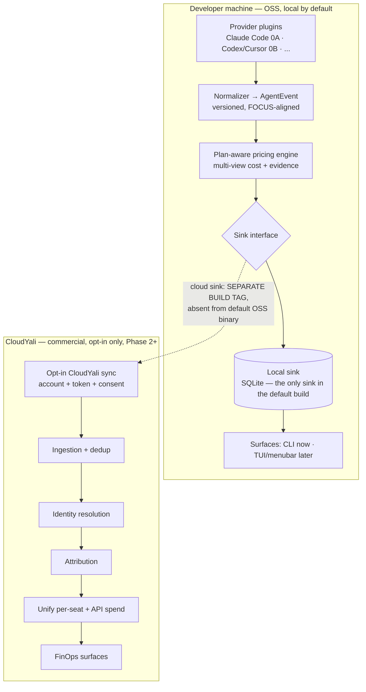

# 01 — Architecture

_Last updated: 2026-06-14 · Stable. Changes here ripple into every phase doc._

This is the shape of the system and the handful of load-bearing decisions that
make "OSS for trust" and "data rolls up to CloudYali" stop fighting each other.
The whole design is one idea repeated at every layer: **read first-party
evidence at the source, normalize it into one versioned contract, price it
honestly with provenance, and let nothing leave the machine unless the user
chooses.**

---

## 1. The pipeline



Data flows in one direction through five stages. Each stage has exactly one
responsibility and talks to its neighbors through an interface, never through
concrete types — so a new agent in 0B or a new sink in Phase 2 is a *plug-in*,
not a *surgery*.

| Stage | Package | Responsibility | One-sentence contract |
|---|---|---|---|
| Locate | `internal/platform` | OS-aware path discovery (macOS/Linux/Windows) + app home | "Here is where this agent's files live on *this* machine." |
| Collect | `internal/provider`, `internal/provider/claudecode` | Detect an agent, enumerate its sources, read only new raw records | "Here are the raw lines newer than your last scan." |
| Normalize | `internal/normalize` | Raw record → `AgentEvent` with source provenance | "Here is that line as a versioned event — minus the price." |
| Price | `internal/pricing` | Fill the cost views + pricing provenance + confidence | "Here is what it cost, in each lens, and how sure I am." |
| Store | `internal/store` | Idempotent persistence + queries | "I'll keep these without duplicating, and answer questions about them." |
| Surface | `internal/cli` (→ `cmd/aispend`) | Render totals and, above all, `explain` | "Here's the number — and here's exactly where it came from." |

Because almost all of this data is sourced from **local files whose locations
differ by OS**, the `Locate` stage is a first-class layer, not inline string
concatenation. Every provider asks `internal/platform` where its files live on
*this* machine (macOS / Linux / Windows, with env overrides) and gets back
existence-checked, OS-correct roots. This keeps "works on every OS" a property of
one tested package instead of a bug waiting in each parser. Full treatment in
[04-platform-and-paths.md](04-platform-and-paths.md).

## 2. The interfaces (the seams)

The architecture is really just these five interfaces. Phase 0A implements the
Claude Code path through them; every later phase adds implementations *behind*
them. Full signatures live in
[phase-0A-trusted-explainable-ledger.md](phase-0A-trusted-explainable-ledger.md);
the shape is:

- **`Provider`** — `Name() · Detect() · Sources() · Read(since)`. One per agent.
  `Sources()` is what lets us *report* unsupported records instead of silently
  dropping them (PRD G1).
- **`Normalizer`** — `Normalize(RawRecord) (AgentEvent, error)`. Pricing is
  deliberately *not* here, so a re-price never forces a re-read.
- **`PricingEngine`** — `Price(*AgentEvent, Plan) error · TableVersion()`.
  Fills `CostViews` and the pricing half of `Evidence`.
- **`Store`** — `Upsert · Query · Get · LastScan · SetLastScan`. Idempotent on
  `EventID`, so re-scanning is safe.
- **`Sink`** — `Write([]AgentEvent) error`. **The single egress seam.** In the
  default build the only implementation is the SQLite-backed `LocalSink`.

## 3. The trust boundary is a compile-time property

This is the most important decision in the codebase, so it is enforced by the
*build*, not by discipline.

Everything that writes events goes **through the `Sink` interface**. The default
`go build ./cmd/aispend` produces a binary whose import graph contains the local
sink and *nothing network-capable*. The cloud sink is a separate file guarded by
a build tag:

```go
//go:build cloudyali
// +build cloudyali

package sink // sink_cloud.go — NOT compiled into the default OSS binary
```

Why a build tag and not a runtime flag: a security auditor reading the default
binary finds **no code that can phone home** — strictly stronger than
"compiled-in but inert," which still trips an audit. The CloudYali build is a
separate, explicit target.

Two CI gates make this testable (see [03-engineering-process.md](03-engineering-process.md)):

- **No user-data egress.** Nothing about the user is ever uploaded. Through Phase
  0A the default build imports **no `net/*` at all** (`go list -deps ./cmd/aispend`
  is net-free), so the trust-MVP is provably offline.
- **`aispend doctor --network`** — a runtime assertion that reports every network
  capability and exits non-zero if a network-capable *sink* (anything that could
  upload user data) is present.

**The one deliberate exception, from Phase 0B:** the LLM pricing module refreshes
prices from our endpoint — ship-embedded plus a daily *inbound* GET
([05-llm-pricing.md](05-llm-pricing.md) §4). That is reference data, not telemetry:
a price file, no spend, no identifiers. It lives in a single isolated
`internal/pricing/refresh` package — the only importer of `net/*` — is opt-out
(`--offline`, config), and is absent entirely from the `//go:build offline`
artifact. So the precise, honest property is **"no user-data egress, ever; the
sole outbound is an opt-out, auditable price fetch."** The cloud *sink* (which
could upload spend) stays behind `//go:build cloudyali`, absent from every default build.

This is the **locked** posture (default ships embedded + refresh-on, opt-out), and
the build-tag seam is already implemented and verified: `internal/pricing/refresh`
is the *only* `net/*` importer, and `go build -tags offline` yields a binary that
imports **no** network code at all (the air-gapped path). In Phase 0A `cmd/aispend`
doesn't yet import the refresher, so today's binary is fully net-free; 0B wires the
daily refresh live.

One transitive case worth knowing: the optional `-tags sqlite` backend pulls `net`
via `modernc.org/libc` (socket/netdb shims the SQLite VFS references — not
networking). So the net-free guarantee is specifically a property of the **default
`FileStore` build** — which is exactly why FileStore is the shipped default and
SQLite is an explicit opt-in for scale.

A second, quieter trust rule rides alongside it: **no raw filesystem paths are
ever persisted or exported** — only `*_path_hash`. The raw path exists only in
memory during `Read`.

## 4. Tech stack and why

| Choice | Rationale |
|---|---|
| **Go**, single static binary | Drop one file on macOS/Linux/Windows/CI — no Node runtime. CI/IT-friendly. First-class OTel SDK for the Phase 1A fleet path. |
| **`modernc.org/sqlite`** (pure-Go) | Local store with no cgo, so the "single static artifact" promise holds. The `Store` interface keeps even this swappable. |
| **`cobra`** for the CLI | Table-stakes command tree; `explain` gets the polish. |
| **Embedded, versioned pricing tables** (`go:embed`) | Prices ship *in* the binary and are stamped onto every event (`PricingTableVersion`, `PricedAt`) for auditability and reproducible re-pricing. |
| **React** (later) | The local web view and the CloudYali console — not in 0A. |

Go's module floor is set to `go 1.25` to match the toolchain in the repo; it can
be lowered toward the PRD's stated `1.22+` once the CI matrix is set up. The
choice is recorded in `go.mod` and noted in
[03-engineering-process.md](03-engineering-process.md).

> **Module path:** `github.com/agentspend/ai-agent-spend` (matches the repo
> folder). There is no git remote yet; if the published path differs, it is a
> one-line `go mod edit -module ...` change and a find/replace of imports — do it
> *before* the first external contributor, not after.

## 5. What is deliberately NOT here

The fastest way to wreck this design is to add a capability before the numbers
it depends on are trusted. The architecture stays honest by *refusing* the
following until their phase:

- **No proxy, gateway, or harness.** We never sit in the request path. We *read*
  enforcement layers' logs and *recommend* fixes in their language (PRD §13).
  The moment we sit in the path, the "it just reads your files" promise dies.
- **No two-surface correlation on the laptop.** A personal API key may not
  represent the service being built; naive local correlation double-counts.
  Correlation is a CloudYali *reconciliation* with identity resolution and dedup
  (Phase 2), not a local feature.
- **No telemetry by default.** Off, full stop. Adoption is measured by stars,
  downloads, issues, and CloudYali connect-rate — never by phoning home.
- **No findings in 0A.** Cost-driver findings (neutral language, fact-based)
  arrive in 0B, *after* the numbers are trustworthy enough to reason about.

See each phase doc's "Out of scope" for the precise line.
