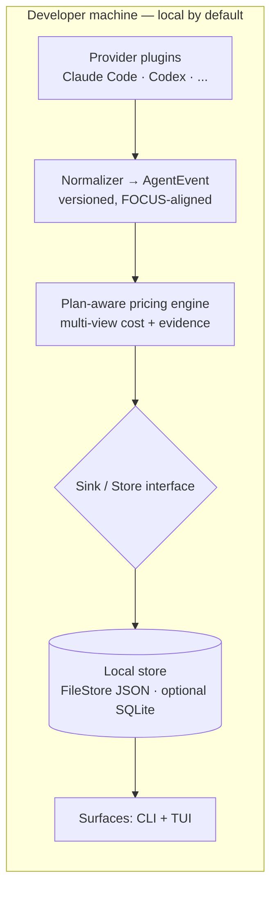
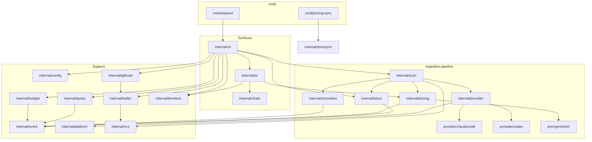

# aispend — Design

This is the single, consolidated design document for **aispend**: what it does,
how it is shaped, and how each module is built. It supersedes the earlier
per-topic and per-phase design notes.

`aispend` is a local, explainable spend tracker for AI coding agents. Coding
agents bill a flat subscription and hide the per-token meter; the cost underneath
is still tokens — input, output, and cache reads/writes. `aispend` reads the
session transcripts those agents already write to disk (`~/.claude`, `~/.codex`),
prices every turn at published API rates, and stores an evidence ledger you can
drill into: any number traces back to its turn, model, token class, file, and
commit.

It is a single static Go binary — no Node, no Python, no daemon required, no
database to run. It reads local files only; the sole optional network call is an
inbound refresh of public model prices, which `doctor --network` discloses and
the `offline` build removes entirely.

---

## Table of contents

1. [Functionality](#1-functionality)
2. [Architecture](#2-architecture)
3. [Module diagram](#3-module-diagram)
4. [Module design details](#4-module-design-details)
5. [Data model](#5-data-model)
6. [Cross-cutting principles](#6-cross-cutting-principles)

---

## 1. Functionality

### What it does

- **Daily glance** — `aispend today` shows API-equivalent spend, subscription
  ROI, prompt-cache savings, and an hourly bar that flags a runaway overnight
  session.
- **Reports over any window** — `aispend report` totals spend over a calendar
  period, grouped by `model`, `provider`, `repo`, `cost_tag`, `session`,
  `branch`, `commit`, or `file`, and rendered in any cost view.
- **The priciest turns** — `aispend top` names the most expensive turns (or
  sessions) in a window.
- **Interactive explorer** — a bare `aispend` (or `aispend tui`) opens a
  navigable TUI: arrow through sessions, press `↵` to drill from a session to its
  receipt, then to a file, then to a single turn's token-by-token evidence.
- **Budgets** — `aispend budget` sets an optional monthly ceiling and shows pace
  ("am I on track for the month?"); it observes, never enforces.
- **Per-commit cost trailers (opt-in)** — `aispend git install` wires git hooks
  that write the api-equivalent cost of the work into each commit's message as
  trailers (`AI-Cost: …`), baking spend into git history.
- **Provably offline** — `aispend doctor --network` asserts the default build has
  no code path that can upload user data. `aispend doctor --paths` shows where
  data lives.
- **Plans & pricing** — `aispend plans` lists known subscription plans; `aispend
  pricing [refresh]` shows the active rate source and optionally pulls live
  rates.
- **Background freshness** — `aispend daemon` keeps the ledger current with a
  watermark-gated incremental scan loop; `aispend sync` does one on-demand cycle.

### How it works (the pipeline, in one line)

Read first-party evidence at the source → normalize it into one versioned
contract (`AgentEvent`) → price it honestly with provenance → store it
idempotently → surface it, with every number openable to its evidence.

On launch, a read command (`today`, `report`, `top`, the TUI) brings the ledger
current with a watermark-gated incremental scan of `~/.claude/projects` and
`~/.codex/sessions`, prices each new turn, and stores the result under
`~/.aispend` — all local. `aispend scan` imports on demand; `--no-scan` reads the
ledger as-is.

### No single "true cost"

Flat plans, pooled credits, amortized subscriptions, included usage, enterprise
discounts, and API-equivalent replacement values are *different* cost concepts.
`aispend` models each as a separate **cost view** and lets the user pick one;
it never presents one as "the truth". A view that cannot be computed from the
available evidence is `nil` — meaning "not computable here", never a misleading
`$0`. The views are *billed*, *reported*, *amortized*, *marginal*,
*api-equivalent*, *credit-consumption*, and *estimated* (see §5).

### Evidence over assertion

Every number carries where it came from — which file and parser produced it,
which price table and when, how the cost was derived, and a confidence score.
The receipt drill in the TUI renders that ledger. This is the product's
differentiator, not an internal detail.

### Supported agents and pricing

- **Ingested today:** Claude Code (`~/.claude`) and OpenAI Codex (`~/.codex`).
  Additional agents (e.g. Cursor, Gemini CLI) are planned behind the same
  `Provider` interface.
- **Providers priced:** Anthropic and OpenAI rates, including the cache tiers
  (Anthropic 5-minute vs 1-hour cache-write, cache-read at the reduced rate).
- **Price source:** an embedded, versioned rate table ships in the binary; an
  optional refresh overlays live rates from the LiteLLM community price table
  (`model_prices_and_context_window.json`), mirrored at
  `aispendllm.cloudyali.io`. The embedded table stays the floor for any model the
  live table omits.

---

## 2. Architecture

The whole design is one idea repeated at every layer: **read first-party
evidence at the source, normalize it into one versioned contract, price it
honestly with provenance, and let nothing leave the machine unless the user
chooses.**

### The pipeline



Data flows in one direction through stages. Each stage has exactly one
responsibility and talks to its neighbours through an **interface**, never
through concrete types — so a new agent or a new storage backend is a plug-in,
not surgery.

| Stage | Package | Responsibility |
|---|---|---|
| Locate | `internal/platform` | OS-aware path discovery (macOS/Linux/Windows) + app home |
| Collect | `internal/provider`, `internal/provider/*` | Detect an agent, enumerate sources, read only new raw records |
| Normalize | `internal/normalize` | Raw record → `AgentEvent` with source provenance (no price) |
| Price | `internal/pricing` | Fill the cost views + pricing provenance + confidence |
| Store | `internal/store` | Idempotent persistence + queries |
| Surface | `internal/cli`, `internal/tui` (→ `cmd/aispend`) | Render totals and open any number to its evidence |

### The interfaces (the seams)

- **`Provider`** — `Name() · Detect() · Sources() · Read(since)`. One per agent.
  `Sources()` lets the tool *report* unsupported records instead of silently
  dropping them.
- **`Normalizer`** — `Normalize(RawRecord) (AgentEvent, error)`. Pricing is
  deliberately *not* here, so a re-price never forces a re-read.
- **`PricingEngine`** — `Price(*AgentEvent, Plan) error · TableVersion()`. Fills
  `CostViews` and the pricing half of `Evidence`.
- **`Store`** — `Upsert · Query · Get · LastScan · SetLastScan`. Idempotent on
  `EventID`, so re-scanning is safe.
- **`Sink`** — `Write([]AgentEvent) error`. The single egress seam; in the
  default build the only implementation is the local store.

### The trust boundary is a compile-time property

Everything that writes events goes through the `Sink`/`Store` interface. The
default `go build ./cmd/aispend` produces a binary whose import graph contains the
local store and *nothing that can upload user data*. The build enforces the trust
promise, not discipline:

- **`go build` (default):** offline by construction. The only `net/*` importer is
  the isolated `internal/pricing/refresh` package, used solely for the opt-out,
  inbound price fetch (reference data — no spend, no identifiers).
- **`go build -tags offline`:** compiles `net/*` out entirely — the air-gapped
  artifact. Also drops the Bubble Tea / lipgloss TUI so the offline build stays
  minimal.
- **`aispend doctor --network`:** a runtime assertion that reports every network
  capability and exits non-zero if anything that could upload user data is
  present.

Two quieter rules ride alongside: **no raw filesystem paths are ever persisted or
exported** (only `*_path_hash`; the raw path exists only in memory during a read),
and **credentials/config are never stored or logged**.

### Tech stack and why

| Choice | Rationale |
|---|---|
| **Go**, single static binary | Drop one file on macOS/Linux/Windows/CI — no runtime to install. |
| **`FileStore` (JSON)** as default | Zero external dependencies; keeps the binary a pure-Go static artifact; ample for one developer's ledger. |
| **`modernc.org/sqlite`** (pure Go), opt-in `-tags sqlite` | Indexed SQL for larger/fleet scale, no cgo, behind the same `Store` interface. |
| **stdlib `flag`** command dispatch | Zero-dependency CLI surface. |
| **Bubble Tea + lipgloss** for the TUI | Isolated in `internal/tui` so the offline build can drop it. |
| **Embedded, versioned pricing tables** (`go:embed`) | Prices ship *in* the binary and are stamped onto every event for auditability and reproducible re-pricing. |

Module path: `github.com/cloudyali/ai-agent-spend`.

---

## 3. Module diagram



`internal/event` is the contract every layer reads; nothing reads a raw file
directly. `cmd/pricing-sync` and `internal/pricesync` are **build/CI tooling**,
not part of the shipped binary.

---

## 4. Module design details

### Entry points

- **`cmd/aispend`** — the binary's `main`. Thin: wires the process to
  `internal/cli` and exits. A bare invocation opens the TUI; off a TTY it prints
  `today`.
- **`cmd/pricing-sync`** — a separate build/CI command (not in the product
  binary) that curates and validates the upstream LiteLLM price table and emits
  the mirror artifact published at `aispendllm.cloudyali.io`.

### Surfaces

- **`internal/cli`** — the command surface: a zero-dependency, stdlib-`flag`
  dispatch that wires provider → normalize → price → store and renders the
  results (`scan`, `sync`, `daemon`, `report`, `today`, `top`, `budget`,
  `doctor`, `plans`, `pricing`, `git`, `version`). Owns period parsing, grouping,
  view selection, table/JSON rendering, and scan-on-launch.
- **`internal/tui`** — the interactive explorer (`aispend tui`): a navigable
  session list that drills to the receipt on `↵`. Isolated from `cli` so it
  imports only Bubble Tea + lipgloss + the data model + the (sqlite-free) pricing
  path, keeping it out of the offline build. This is where a number opens to its
  evidence: session → file → turn.
- **`internal/chain`** — builds the chronological "prompt chain" of a work
  session: the conversation replayed turn-by-turn with a cumulative-cost gutter,
  grouped by the user prompt (`PromptID`) that triggered each run of turns.

### Ingestion pipeline

- **`internal/scan`** — orchestrates the pipeline: a provider's raw records are
  normalized, priced, and written to the store, with a summary of what happened.
  Re-scanning is safe (idempotent on `EventID`); it is the seam the `aispend
  scan` command drives, and it runs the best-effort VCS enrichment pass.
- **`internal/provider`** — defines the `Provider` interface (one implementation
  per AI coding agent) and the `RawRecord`/`Source` types that carry
  un-normalized data from an agent's local files into the normalizer.
  - **`internal/provider/claudecode`** — reads Claude Code transcripts from
    `~/.claude/projects/**/*.jsonl`.
  - **`internal/provider/codex`** — reads OpenAI Codex rollout JSONL from
    `~/.codex/sessions` (date-based or thread-id layouts via a recursive glob).
- **`internal/normalize`** — converts a provider's `RawRecord` into a versioned
  `event.AgentEvent` with source provenance filled in. Pricing is applied
  separately so a re-price never requires a re-read. Owns per-agent
  deduplication: Claude Code collapses streaming-placeholder lines by
  `(message.id, requestId)` keeping the max-token entry; Codex normalization is
  stateful per session because token usage and model/cwd arrive on separate
  lines.
- **`internal/pricing`** — fills an event's `CostViews` and the pricing half of
  its `Evidence` from embedded, versioned rate tables, preferring a tool-written
  reported cost when present and otherwise computing api-equivalent from tokens ×
  rate (with the cache-tier splits). Includes `litellm.go`, which parses the
  subset of the LiteLLM price table aispend prices on and overlays it onto the
  embedded table (which stays the floor).
  - **`internal/pricing/refresh`** — the *only* `net/*` importer: the isolated,
    opt-out, inbound fetch of the price table. Absent from the `offline` build.
- **`internal/store`** — idempotent persistence behind the `Store`/`Sink`
  interface. `FileStore` (the default) writes a single atomic JSON document at
  `~/.aispend/events.json` with zero dependencies; `SQLiteStore` (opt-in
  `-tags sqlite`) uses `modernc.org/sqlite` with the full event as JSON plus
  denormalized scalar columns for indexed filtering. Both run the same test
  contract.

### Support

- **`internal/event`** — the core contract: `AgentEvent`, its `SchemaVersion`,
  and `Money` (integer micro-units, never a float). Every surface reads this; the
  golden fixtures enforce it.
- **`internal/platform`** — centralizes OS-aware path discovery so "works on
  every OS" is a property of one tested package instead of a bug waiting in each
  parser; honours env overrides and returns existence-checked roots.
- **`internal/config`** — a small zero-dependency loader for `.aispend.toml`
  (repo-level attribution: project, cost_tag, env) and `~/.aispend/config.toml`
  (plan, budget, scan cadence). Parses the flat subset aispend uses to keep the
  binary dependency-free.
- **`internal/budget`** — models an optional, informational spend ceiling against
  the api-equivalent view. It observes, never enforces: a pace gauge, not a gate.
- **`internal/quota`** — models a provider's plan-limit window (the weekly/5-hour
  wall on a subscription) as a point-in-time reported snapshot, kept deliberately
  separate from the priced evidence ledger.
- **`internal/vcs`** — reconstructs git provenance for a turn from the repository
  on disk, best-effort and dependency-free (no git binary, no network): recovers
  the SHA that was HEAD at a turn's timestamp from the reflog and captures
  per-file churn. Empty when unresolvable — never guessed.
- **`internal/trailer`** — the write path for commit cost-trailers: formats the
  per-commit trailer lines (`AI-Cost: …`), applies them idempotently, folds
  duplicates carried in by a squash, and drives the per-branch watermark.
- **`internal/githook`** — installs, removes, and reports the per-commit
  cost-trailer git hooks (`prepare-commit-msg` + `post-commit`); the write-path
  setup that honours existing hook managers and refuses to clobber.
- **`internal/termtext`** — neutralizes terminal control sequences in untrusted,
  session-derived strings before they are written to a TTY.

### Build/CI tooling (not in the shipped binary)

- **`internal/pricesync`** — curates and validates the upstream LiteLLM price
  table before it is published to the aispend-hosted mirror. Imports no `net/*`;
  the fetch is performed by the CI workflow.

---

## 5. Data model

`AgentEvent` is the core asset, stamped with a `SchemaVersion` so older and newer
shapes remain ingestible. The Go code in `internal/event` is the source of truth;
golden fixtures (`testdata/golden/`) enforce it.

### `AgentEvent` (selected fields)

`EventID` (stable hash of the dedupe key), `SessionID`, `PromptID`, `Provider`,
`Surface`, `IdentityHash`, `Project`/`Repo`/`CostTag` (attribution),
`GitBranch`/`GitSHA`/`Files`/`SessionChurn` (the spend → shipped-code link),
`Model`, `Mode`, `Tokens` (input/output/cache-read/cache-write), `CostViews`,
`Evidence`, and timestamps. The VCS fields are additive (no `SchemaVersion`
bump) and empty when unresolvable.

### `Money` — integer micro-units, never a float

```go
// 1 USD = 1_000_000 micros. $0.42 = 420_000 micros.
type Money struct {
    Micros   int64
    Currency string
}
```

Micros (not cents) because token pricing is sub-cent. All arithmetic is integer;
rounding happens once, at render time.

### Cost views — no single "true cost"

| View | Meaning |
|---|---|
| **Billed** | What appears on the provider invoice (needs reconciliation; `nil` locally). |
| **Reported** | A cost the tool itself wrote to disk (e.g. Claude Code `costUSD`). Authoritative when present and `> 0`. |
| **Amortized** | Subscription/seat fee spread across observed usage (needs a configured plan). |
| **Marginal** | Incremental overage beyond included quota. |
| **API-equivalent** | What the usage would cost at public API rates — always computable. |
| **Credit-consumption** | Usage converted into platform credits. |
| **Estimated** | Inferred when nothing authoritative exists; equals api-equivalent with no plan, and is flagged as an estimate. |

The rule that makes this trustworthy: a `nil` view means "not computable here",
never "zero".

### The evidence ledger

Every `AgentEvent` carries an `Evidence` record answering "why is this number what
it is": source provenance (file/parser, hashed path, line), pricing provenance
(table version, priced-at, discount basis), cost method, confidence score and
reason, known-missing fields, dedupe key, and reconciliation status. This is what
the receipt drill renders.

### Attribution & plans

`.aispend.toml` at a repo root stamps `Project`/`CostTag` onto events via
nearest-ancestor resolution — the seam a centralized rollup would speak in
cost-center terms. `~/.aispend/config.toml` holds plan configuration (default and
per-provider plans, each amortized over only that provider's usage, billing-cycle
aware via `plan_start`).

### Storage

`FileStore` is the default (one atomic JSON document, zero deps). `SQLiteStore`
(`-tags sqlite`) stores the full event as JSON plus denormalized scalar columns
for indexed filtering. `Upsert` is keep-max on an `EventID` collision so split
streaming lines never double-count. `AgentEvent` maps onto the FinOps FOCUS spec
so any future FinOps export is a projection, not a migration.

---

## 6. Cross-cutting principles

These are enforced in code, not just prose:

- **Local by default, truthfully.** The default build contains no code that can
  upload user data; a security audit of the binary finds nothing that can phone
  home. CI asserts it. The sole outbound is an opt-out, auditable inbound price
  fetch.
- **No single "true cost".** Each cost view is modeled with provenance and a
  confidence marker; `nil` means "not computable", never "zero".
- **Evidence over assertion.** Every number carries where it came from, which
  parser and pricing table produced it, and how confident we are.
- **Money is never a float.** Integer micro-units with an explicit currency.
- **One contract.** Everything reads `AgentEvent`; nothing reads a raw file
  directly. Schema changes are versioned — additive changes don't bump the
  version; breaking changes do, and the store records the version per row.
